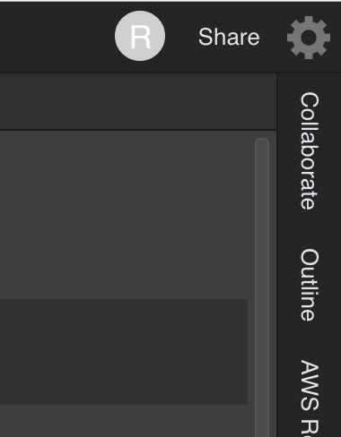
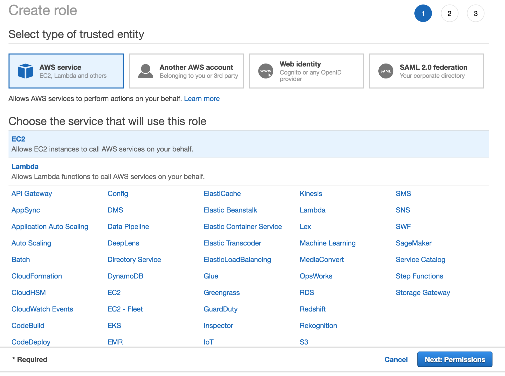
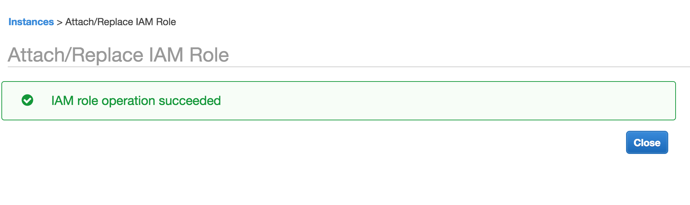
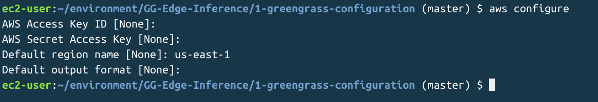

# Environment Configuration

## Creating your Cloud9 Environment (optional)

Amazon Cloud9 is a web-based IDE -- we will use it to configure the Greengrass settings for the target device and execute different AWS commands.

> **Alternatively, you can simply clone this repository and run from your own computer (assuming that you have Python3 and boto3 correctly installed and user permissions are sufficient to execute on your AWS account). If so, please go directly to [Clone Workshop Content - Local](#clone-workshop-content---local)**

1. From the AWS console, go to the [Amazon Cloud9](https://console.aws.amazon.com/cloud9/home?region=us-east-1) console and select the **Create Environment** button to fill in the following information:
    1. Step 1: Name environment
        - *Environment name*: `ml-edge-workshop-lab-1`
        - *Description*: *\<blank/empty\>*
        - Click **Next Step** to proceed
    1. Step 2: Configure settings
        - Leave the defaults, and click **Next Step** to proceed
    1. Step 3: Review
        - Click **Create Environment** to finish and begin IDE environment creation
   If successfully, you should now be in your new Cloud9 environment. We will now clone this git repository so we have access to this and other labs throughout the remainder of the workshop.
1. Once successfully launched, you will then see the following Welcome screen as shown here: 
1. Click the gear icon in the upper right of the environment, which will open a new tab in Cloud9 for setting Preferences (your screen colors may vary): 
1. Select the AWS Settings tab on the left, and then disable the **AWS managed temporary credentials** option (which is on by default) 
1. Close the Preferences tab at the top, returning to the Welcome tab.

## Setting AWS IAM role - Cloud9

Your Cloud9 development environment is a running EC2 instance in your region and default VPC. We will now make a change to that instance so that we will have the superpowers necessary to perform administrative tasks in your AWS environment.

> **Caution: we will be applying additional policy for the Cloud9 environment to act on your behalf by attaching an IAM role to the underlying EC2 instance. Best practice would be to create a bespoke IAM policy to limit the potential actions performed from Cloud9, which is why we are making this additional change to elevate privileges. To ensure the safety of your environment, you should close and terminate this Cloud9 instance after completion of this workshop.**

1. Go to your AWS console, in the specific region where you launched your Cloud9 instance, and select to view your EC2 instances.
1. Identify the instance that is connected to your Cloud9 instance, which will be named as **aws-cloud9-...** where **...* will be both the name you assigned to your instance and a unique identifier
1. Select this instance, and under the **Actions** button, select the **Instance Settings** > **Attach/Replace IAM Role**.
    
1. Next, click the **Create new IAM role** link.
1. Next, click **Create Role** button.
1. Next, from the Create Role screen, select **AWS Service** from the top, followed by **EC2** then click the **Next: Permissions** button:
    
1. Next, attach the AdministratorAccess policy to this role and click the **Next: Review** button
    
1. Next, enter a role name for this role that will help identify it for use and later deletion (`ml-edge-workshop-cloud9-ec2` in our example), and click **Create Role** button.
    
1. We have just created a role for our Cloud9 EC2 instance, and we will now assign it to that instance. Return to the EC2 console, and you should be able to click the Refresh (circular arrow) button and then filter for the new role you created, then click **Apply** button:
    
1. You will see the action of changing the EC2 instance IAM role occurring, which may take a several moments to complete.
    
1. Finally, you should see Success as shown below:
    

### Congratulations, you have successfully configured Cloud9 for use in administering this workshop! Next, we will clone the repository with the workshop and labs

## Clone Workshop Content - Cloud9

1. From the Getting Started panel on the right of the IDE, select **Clone Git Repository** and provide the URL of this repository (ie. https://github.com/zukoo/GG-Edge-Inference):
    ```bash
    git clone https://github.com/zukoo/GG-Edge-Inference
    ```
1. We will also set up the environment for executing our code by entering the following in a shell prompt:
    ```bash
    export PATH=/opt/c9/python3/bin:$PATH
    pip3 install boto3
    ```

1. We will also need to configure the default region for our scripts -- within the shell, execute the following, using the \<region_name\> for your specific region:
    ```bash
    aws configure
    ```
    Your responses should look like the following, with your chosen region for the third prompt:
    

## Clone Workshop Content - Local

1. Clone the workshop content to a local directory:
    ```bash
    cd <your preferred scratch directory location>
    git clone https://github.com/zukoo/GG-Edge-Inference
    ```

### Congratulations! We are now ready to begin [Lab 1 - Greengrass Configuration](https://github.com/zukoo/GG-Edge-Inference/tree/master/1-greengrass-configuration) activities on your Cloud9 environment
