# Introduction

This lab will guide the user through

- TODO

## Setup your Amazon S3 bucket

As a part of this workshop, we will create an Amazon S3 bucket which will be used to later host your machine learning (ML) models that will be deployed to your device using AWS Greengrass.

1. Using the AWS console, select your target region in the upper left corner. For this workshop material, we consider `us-east-1` to be the default. While other regions can be used, be sure all the necessary services are available in the target region and that all workshop resources, including this bucket, share the same region.
1. Select the S3 service from the AWS console.
1. Create a new S3 bucket, entering a unique name.
> Note: Amazon S3 buckets require a globally unique name to be created, regardless of the region where they are hosted, and also have some restrictions on naming.
1. Select the remainder of the options as default -- ie., click the Next button three times until the process is complete and your new bucket is created.

## Setup your AWS Lambda Function

We will first create an AWS Lambda function that will be run later on the device using AWS Greengrass. Our first pass for this function is just an empty Hello World function, but we will update its code later during the next Lab.

1. Create a new AWS Lambda, this function will be used for inference:
    - Choose `ml-edge-workshop-lab-1` as the function name
    - Choose `Python 2.7` as the runtime,
1. After creating your new Lambda function, we need to assign an alias pointing to `$LATEST`
    - First, select your new Lambda function and click the **Action** button, and select **Create Alias** from the drop-down menu as shown:
        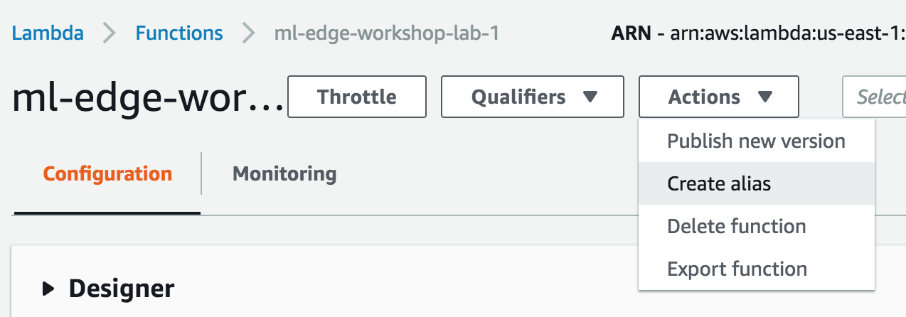
    - Next, fill in the **Name** field with the word **latest** and select the **Version** of **\$LATEST** as shown here, then click the **Create** button
        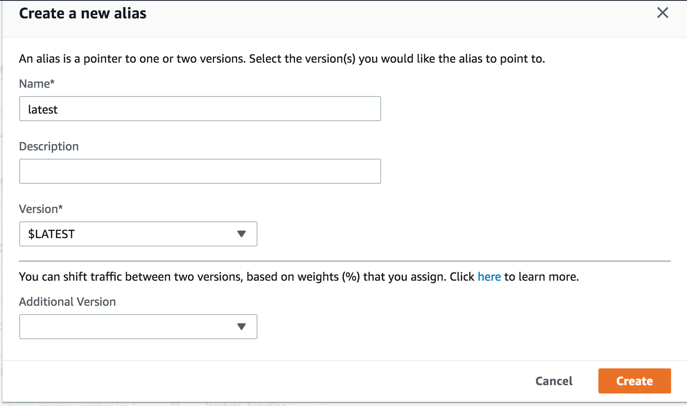
    - If successful, you should see the following:
        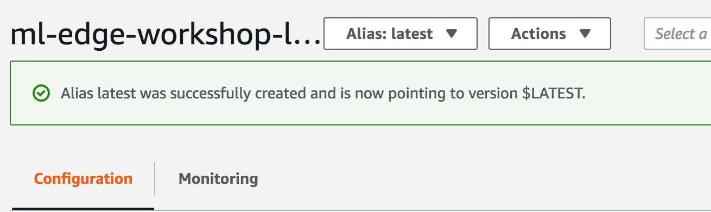
    - You can now continue to the next section

### Congratulations! We are now ready to begin Lab 1 activities in your local environment

## Lab 1 Activities

1. From within the cloned directory, we will now switch to the directory for Lab 1 content and perform some necessary setup of our environment before we begin:
    ```bash
    cd GG-Edge-Inference/
    cd 1-greengrass-configuration/
    ```
1. Within this directory, we will use the `create-greengrass-config.py` script to generate the necessary groups for publishing our Greengrass function:
    ```bash
    python3 create-greengrass-config.py --create-group ml-edge-workshop --bucket ml-edge-workshop-lab-1 --function ml-edge-workshop-lab-1
    ```

    The above command is executed with the following parameters:

    - **--create-group *\<group_name\>***: the group_name that will appear in your AWS IoT console referring to this device
    - **--bucket *\<bucket_name\>***: the bucket_name of the Amazon S3 bucket you created earlier
    - **--function *<function_name\>***: the function_name of the AWS Lambda function you created earlier
1. If successful, you should see similar output to the following:
    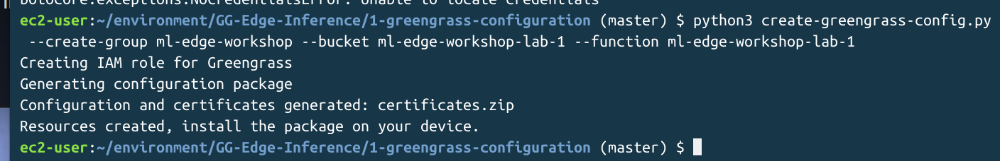

1. *If using Cloud9*, you will need to download the certificates from the Lab 1 folder in the left-most project pane -- first select the `certificates.tar.gz` file with a single click, then left-clicking (Ctrl+Click on Mac OS X) to see the **Download** option as shown below:
    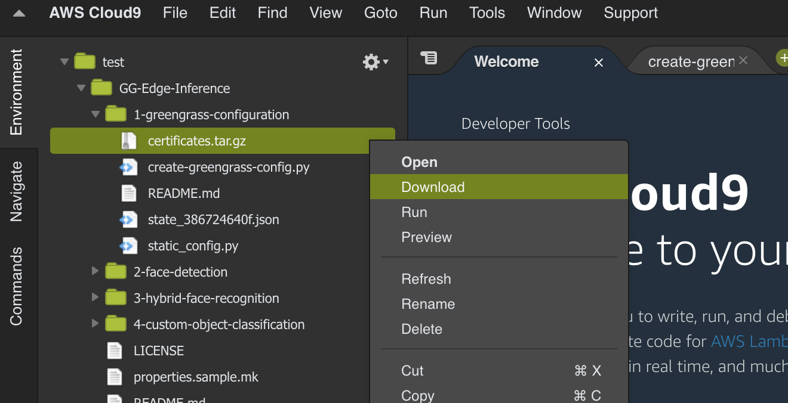

## Install Certificates on Device

We will now install the AWS IoT certificates that we just created onto your local device

1. Download the `certificates.tar.gz` file from your Cloud9 instance, or locate it on your local drive.
1. Next, on the Jetson TX2 device, press the button **S3** or **REC** found on the edge of the board:
    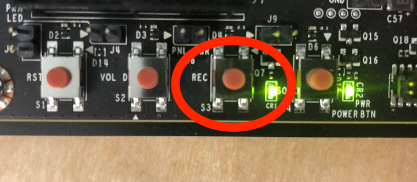
1. Identify the device IP and connect to that IP on port 80/http with a web browser.
    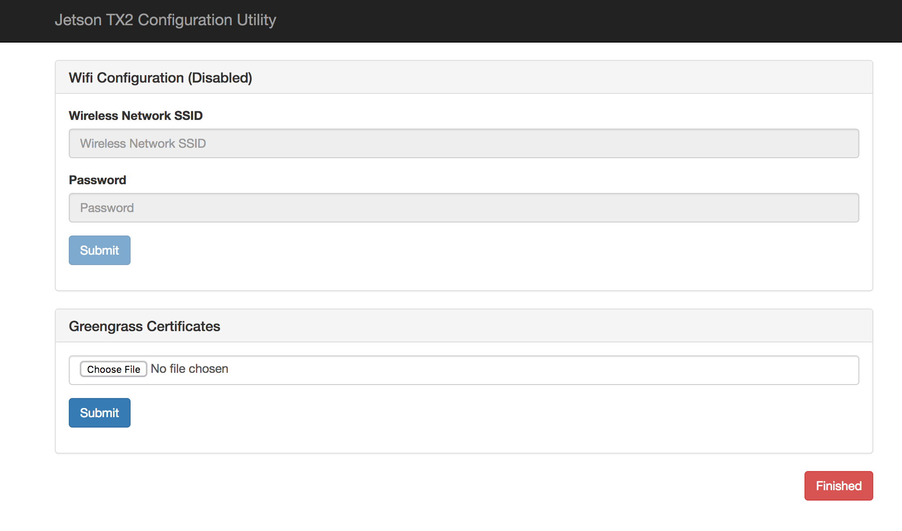
1. In **Greengrass Certificates**, click **Choose File**, and select the `certificates.tar.gz` you had generated earlier, then click the **Finished**.
1. The device will display as follows, indicating device restart which is now occuring:
    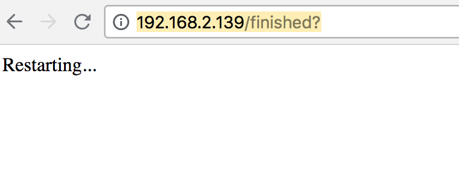

## Deploy the greengrass group to the Device

1. Check the AWS IoT Console to see the status of your Greengrass group's deployments, it should be empty.
    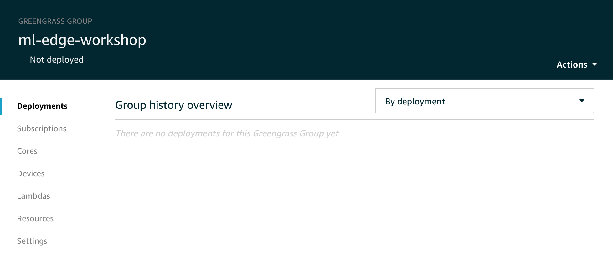
1. Click the **Actions** button, and select **Deploy** as shown below:
    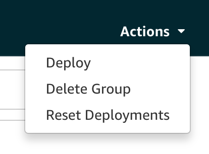
1. Next, we will choose to grant permissions to Greengrass by clicking **Grant permission** (shown below):
    
1. Next, we will choose how Greengrass detects your device connection information. Click **Automatic detection** (shown below):
    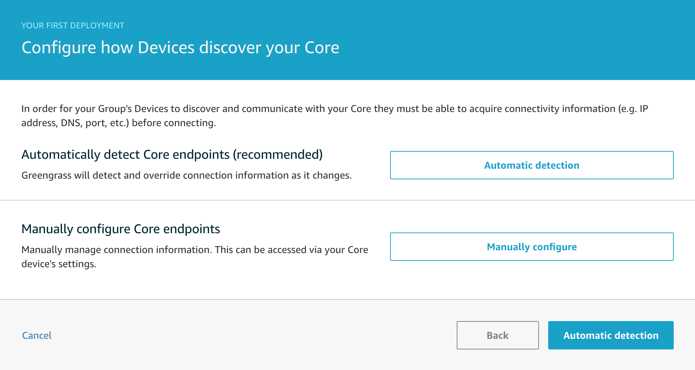
1. A new deployment should have been created, the status should be "In Progress". We will need to wait a bit for the deployment to be successful.
    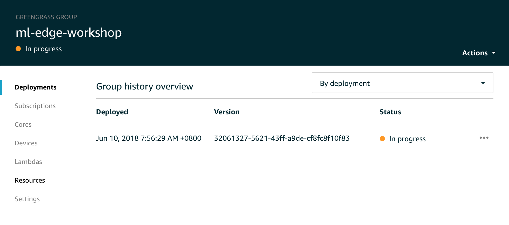

## AWS IoT Connection

Now that the certificates are properly installed, we will attempt to confirm via the AWS Console:

1. From the AWS console, select IoT Core. We should see the AWS IoT Monitoring console as shown below, with a dot on the graph indicating a successful connection to our device.
    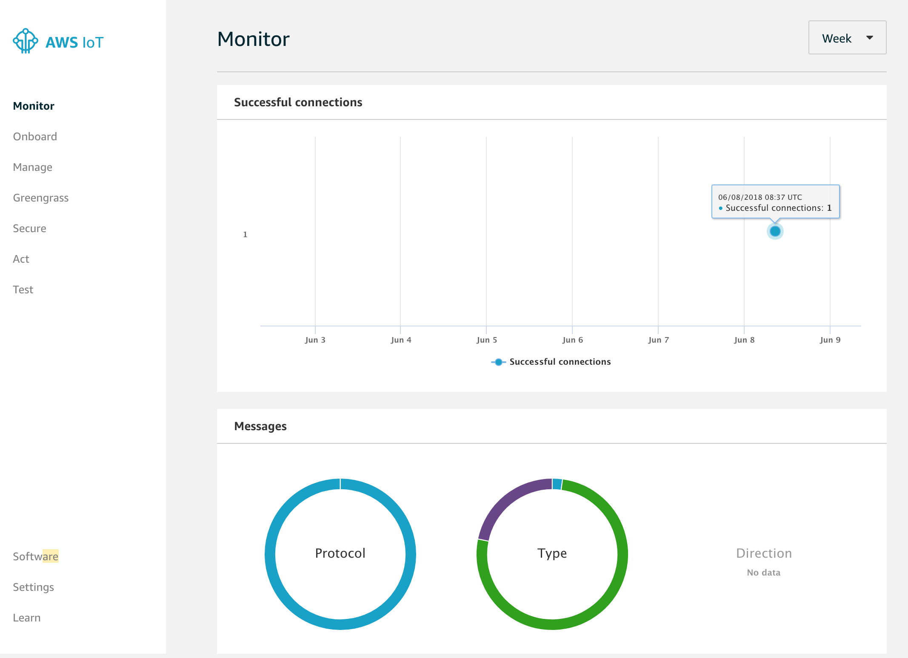

### You're now set to start doing some ML@Edge! Proceed to Lab 2

## Addendum: create-greengrass-config.py Usage

### Create Group

`python3 create-greengrass-config.py --create-group <GROUP_NAME> --bucket <BUCKET_NAME> --function <FUNCTION_NAME>`

### Delete Group

`python3 create-greengrass-config.py --delete-group`

### Get IP Address

`python3 create-greengrass-config.py --ip-address`
