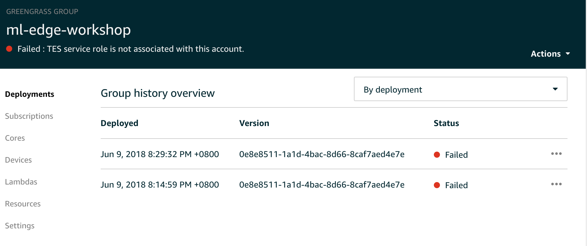
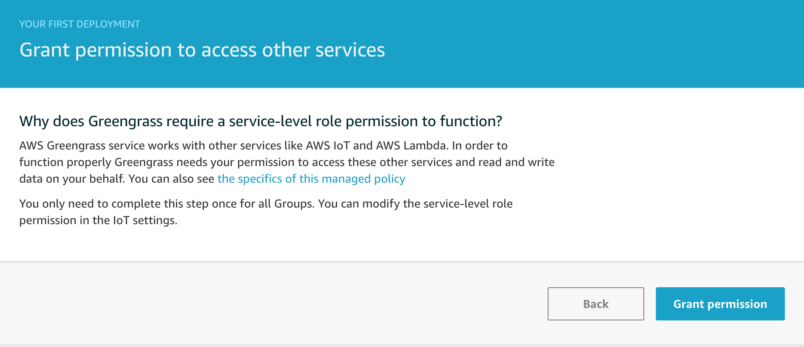
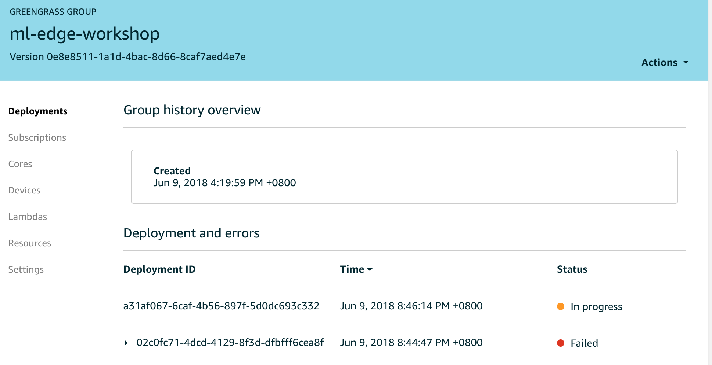

# Lab 2: Face Detection

We will now deploy our first machine learning model to the device using Greengrass.

## Switch to Lab 2 directory

If at the root of the repository, run the following commands to switch to the current path for the lab files by running the following in your shell:

```
cd GG-Edge-Inference
cd 2-face-detection
```

> Also, if you are running this lab on Cloud9, make sure that your PATH is correct. You can do so by running the following command -- **this is not necessary or even recommended if you are running on your own local machine**:
```
export PATH=/opt/c9/python3/bin:$PATH
```

## Make

1. At the root of the workshop repository path -- ie. the parent directory of this lab -- there is a file called `properties.sample.mk`. We will be copying this sample file for our lab by running the following command in your shell (assuming that you are in the current lab path):

```
cp ../properties{.sample,}.mk
```

1. The newly created file, called `properties.mk`, will have specific sections that you will need to edit to match your own settings:

    - REGION: should match your AWS region (default is *us-east-1*)
    - BUCKET: should match the Amazon S3 bucket you created as part of the workshop setup
    - GG_GROUP: should match the name of the AWS Greengrass group you created during [Lab 1](../1-greengrass-configuration) (default is *ml-edge-workshop*)
    - LAMBDA_FUNCTION: should match the name of the AWS Lambda function you created during [Lab 1](../1-greengrass-configuration) (default is *ml-edge-workshop-lab-1*)

1. Once you have edited the file to match your own configuration requirements, we can now run the `make` command in the current path. This will execute a make operation against the `Makefile` in the current path, which references the `properties.mk` file in the parent path.

1. Go in the first directory `2-face-detection`.

1. Run `make`. This will package, then deploy, the new Lambda function and all the required libraries to perform face detection on your device.

## Confirming Deployment to Device
1. Check the AWS IoT Console to see the status of your deployment:

1. Fortunately, Greengrass is super-secure, so we will need to perform some manual steps to confirm that Greengrass service can connect to the other required services. First, we click the **Actions** button, and select **Deploy** as shown below:

1. Next, we will choose to grant permissions to Greengrass by clicking **Grant permission** (shown below):

1. Now we should see a different "Failed" message (as shown below)...

1. Now, we can return to our shell and run the previous `make` command once again, which will now be shown as **In Progress** when we refresh the GG console:

1. We will need to wait a bit for the deployment to be successful.

TODO: can the above be automated via [](https://docs.aws.amazon.com/greengrass/latest/apireference/associateserviceroletoaccount-put.html)?


## Bonus L33T Tricks (Local Users with Linux/Mac and mplayer installed)

1. After the deployment is done you can view the output with: `ssh <DEVICE-IP> cat /tmp/results.mjpeg | mplayer - -demuxer lavf -lavfdopts format=mjpeg:probesize=32`

1. In the console subscribe to the topic `face_recognition/#`, it will show you everything going on with the device.

1. Post a message to the `face_recognition/match/DEVICE_NAME` with content `{"OLD_NAME": "NEW_NAME"}`.

**There is currently an issue with this function that makes it freeze for around 30 seconds the first time it sees a face, however this only happens once.**

You should be able to see the results of the inference both in the topic and the video stream. Great! Now you've used the basic components of Greengrass, let's move on and start doing your own models.