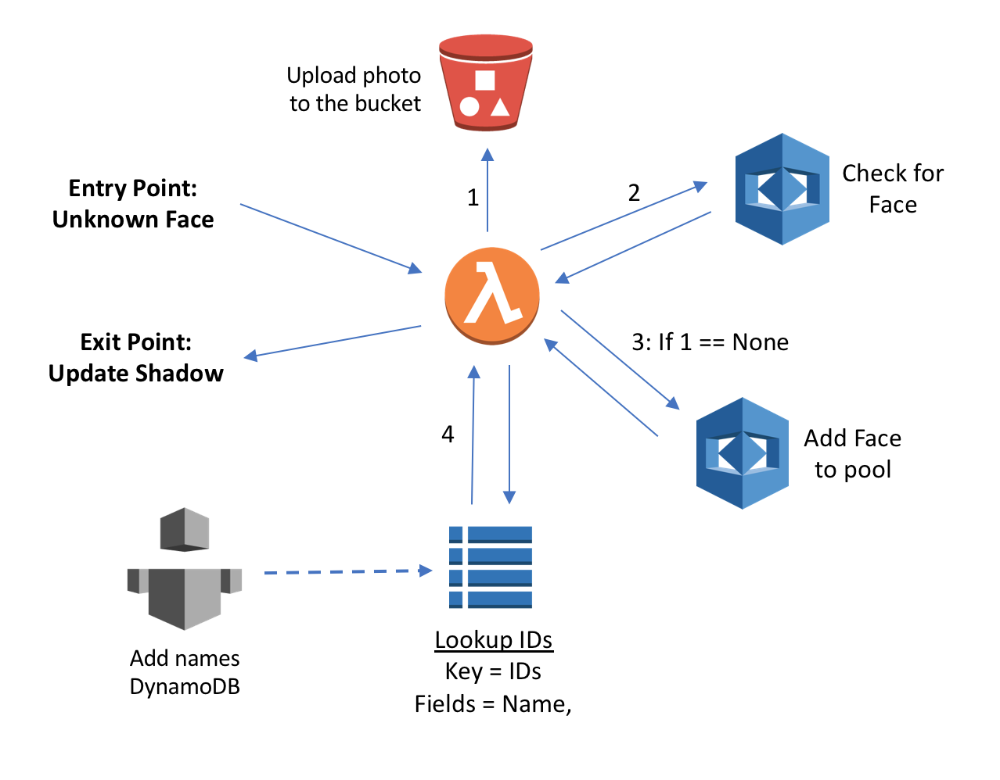

# Hybrid Face recognition between Cloud and Edge

During Lab 2, we were able to publish a simple face detection and recognition model to your  device. This model is capable of both detecting and "remembering" the last few faces seen by the device, but it is still quite limited and is missing the following features that would be desirable:

    - a repository of labeled faces shared among devices
    - a method to compare faces
    
Fortunately, these features are provided by Amazon Rekognition, so we will use Rekognition to store the faces into a face collection and label those faces for later lookup. While Amazon Rekognition could actually provide all of the necessary inference capabilities, we will utilize inference at the edge to reduce the number of redundant API calls, such as repeatedly identifying a face through several frames when the device has already received an answer.

Because the device itself is capable of running a part of the inference, by reducing unnecessary or redundant API calls, we can deliver a more cost-effective and responsive solution at the edge, while leveraging the accuracy of the face comparison and identification that is provided by Amazon Rekognition.

## Process Flow



Our new architecture will consist of the following flow-of-control:

- first, a face is detected by the device, and, if not a part of its local cache of recently identified faces [Entry Point], the Lambda function will upload this unknown face is uploaded onto Amazon S3 [1]
- next, the Lambda function calls Amazon  Rekognition, providing the S3 URI for that image file and comparing that image [2] to the application's face collection
- if no match is found, the Lambda function will add that face to the pool [3]
- finally, for those faces that have previously been identified, the Lambda will lookup the name associated with that specific face as stored in a DynamoDB table [4] in order to obtain that information and pass that information back to the device via the device shadow [Exit Point]

> You can choose to overwrite the previous Lambda function from Lab 2, or you can choose to create a new Lambda one (with the same alias latest). If you choose to create a new Lambda function, you must repeat the section from [Lab 1 - Greengrass Configuration](https://github.com/zukoo/GG-Edge-Inference/tree/master/1-greengrass-configuration) labeled **Setup your AWS Lambda Function**, creating a new Greengrass group using the create-greengrass-config, for example:

```bash
python3 create-greengrass-config --function <YOUR_FUNCTION>
```

## Switch to Lab root

If at the root of the repository, run the following commands to switch to the current path for the lab files by running the following in your shell:

```bash
cd GG-Edge-Inference
cd 3-hybrid-face-recognition
```

## Provision our new hybrid solution

Next, we will perform a `make` to build and deploy our Lambda function to our device to support the new process flow mentioned above.

```bash
make
```

And remember that you cannot have these two Lambda function running on the device at the same time *because the two functions cannot share a single camera feed simultaneously* so you should reuse the same function name to update the code in place.

The `make` file executes an AWS Cloudformation script that does the following:

- Create another Lambda function which will be using Rekognition to resolve the name of the faces it receive, only create it in the cloud this time.
- Create a DynamoDB table with a primary key id of type string.
- Create a face collection in Amazon Rekognition
- Edit the current Lambda code on the device, adding the cropping of any faces not been identified yet, and send those unknown faces to Amazon Rekognition for identification -- how this works is:
    1. Local (Greengrass) Lambda function sends an message that an unrecognized face has been identified, places the message on an IoT topic of 'face_recognition/new'
    2. In the cloud, AWS Lambda is subscribed to the topic above
    3. When the Lambda receive a new face.
        - Save it in S3,
        - Send it to Rekognition:
            - If Rekognition knows it: Lookup the ID In DynamoDB, add the ID -> Name in the shadow of the device.
            - Else add it to the pool, and save it in DynamoDB.
    4. Populate the DynamoDB table with a few names.

- When you get a shadow update edit the key of the known face.

After that you should see the name of the person that you configured in recognition instead of "UserXYZ".
